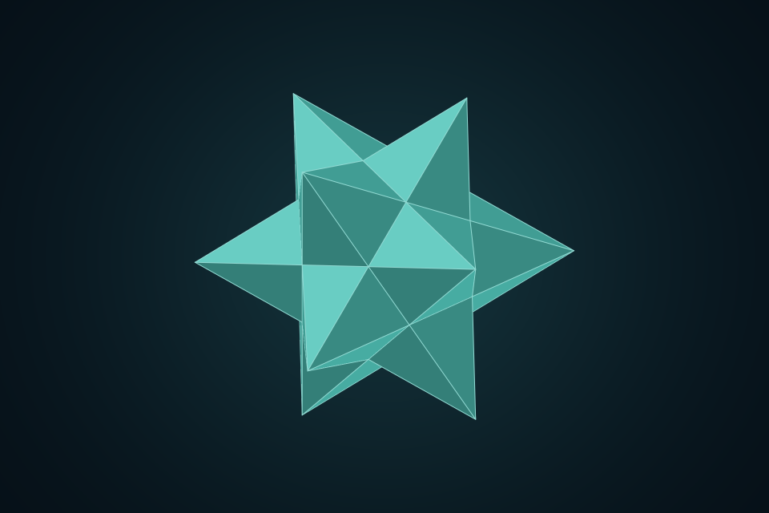
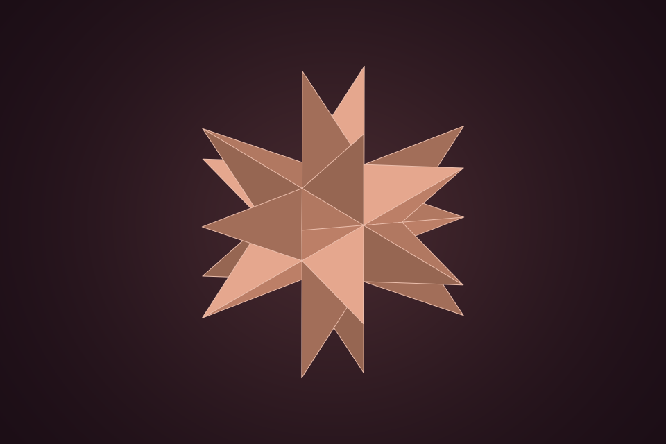
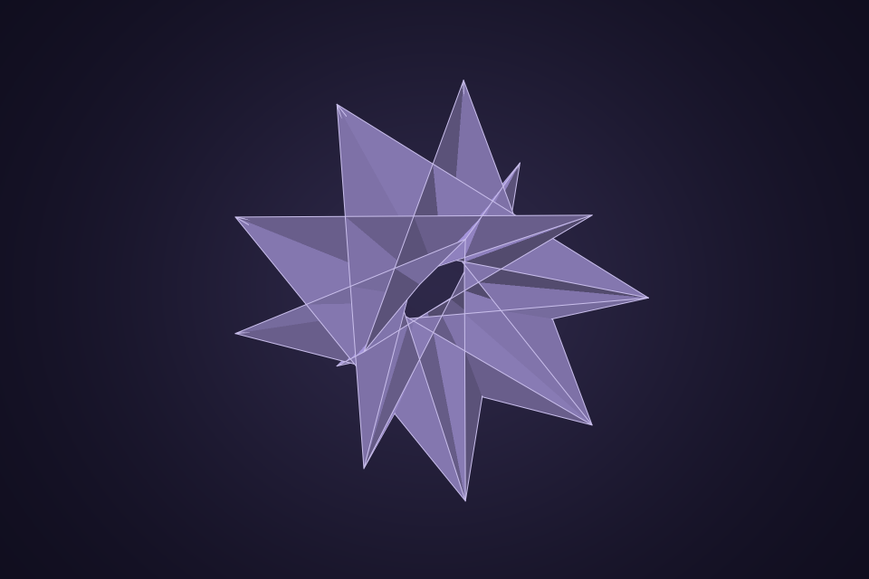

# Noble Shapes

Create, explore, and render noble polyhedra in the browser or Node.js. The catalogue covers **146 finite forms** and generators for the two infinite families. Geometry, colors, and rendering are available through small TypeScript packages, a native web component, and a visual editor.

**[Explore the site](https://nobleshap.es)** · **[Create a shape](https://nobleshap.es/3d)** · **[Documentation](https://nobleshap.es/documentation)**

| Small stellated dodecahedron | Great stellated dodecahedron | Stephanoid |
| :---: | :---: | :---: |
|  |  |  |

These images were generated by the included Node renderer. The [showcase](https://nobleshap.es/showcase) has more examples, each linked to an editable design.

## Try it now

The npm packages are prepared but **have not been published yet**. Clone the repository to run the editor and examples today:

```sh
git clone https://github.com/jakiestfu/noble-shapes.git
cd noble-shapes
corepack enable
pnpm install
pnpm dev
```

Open the local address printed by Next.js, or use the [live editor](https://nobleshap.es/3d).

## Package API

The `noble-shapes` package groups the geometry, renderers, component, and CLI. Its parts are prepared for separate publication as `@noble-shapes/core`, `@noble-shapes/render`, `@noble-shapes/web-component`, and `@noble-shapes/node`. After the first npm release, install it with:

```sh
npm install noble-shapes
```

**On a web page:** import the custom element once, then use it in HTML or JSX.

```ts
import "noble-shapes/web-component";
```

```html
<noble-shape random="your-username" style="width: 320px; height: 320px"></noble-shape>
```

The same `random` string produces the same shape and appearance. Set `shape`, `palette`, `view`, or `color` to override individual choices.

**In Node.js:** render a PNG without a browser or native canvas dependency.

```ts
import { savePng } from "noble-shapes/node";

await savePng("shape.png", {
  shape: "great-stellated-dodecahedron",
  palette: "coral",
  width: 512,
  height: 512,
});
```

**From the command line after the first npm release:**

```sh
npx noble-shapes --shape cube --out cube.png
```

For geometry access, React custom-element types, shareable design codes, exports, and renderer options, see the [usage guide](DOCUMENTATION.md) and [catalogue](CATALOGUE.md).

## Develop

This is a pnpm monorepo. After cloning it, run `pnpm test` for the build, type check, geometry checks, renderer checks, and Open Graph image checks. Run `pnpm render:showcase` to regenerate the images above. See [CONTRIBUTING.md](CONTRIBUTING.md) before changing the mathematical catalogue.

The site omits analytics by default. To enable Google Analytics 4 for a build or deployment, set `NEXT_PUBLIC_GOOGLE_ANALYTICS_ID` to a measurement ID such as `G-ABC123`. Next.js includes the Google tag on every page only when that variable is set.

The geometry is an independent implementation informed by [Connor Hill's classification](https://arxiv.org/abs/2607.28711). No code or model files from the GPL-licensed `noble-tools-revised` project are included.

MIT licensed. See [LICENSE](LICENSE).
